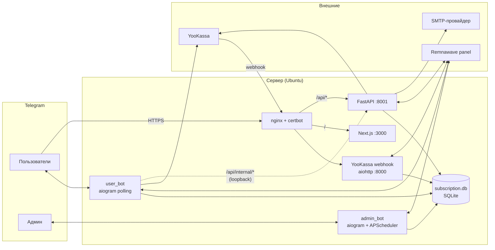

# KairaVPN

Платформа для управления VPN-подписками поверх [Remnawave](https://remna.st/):
два Telegram-бота (админ и пользователь), web-кабинет (Next.js + FastAPI) и
интеграция с YooKassa для приёма платежей.

> Этот документ — единая точка входа. Если ты впервые видишь репозиторий —
> читай по порядку. Здесь же ты найдёшь как поднять всё локально, как
> протестировать перед продакшеном и где почитать про деплой.

---

## Содержание

1. [Стек и компоненты](#1-стек-и-компоненты)
2. [Структура репозитория](#2-структура-репозитория)
3. [Архитектура](#3-архитектура)
4. [Источники правды (где какие данные)](#4-источники-правды)
5. [Быстрый старт: локальный dev-стенд](#5-быстрый-старт-локальный-dev-стенд)
6. [Тестирование перед продом](#6-тестирование-перед-продом)
7. [Production-деплой](#7-production-деплой)
8. [Эксплуатация: обновления, перезапуски, логи](#8-эксплуатация)
9. [Troubleshooting и FAQ](#9-troubleshooting-и-faq)

---

## 1. Стек и компоненты

| Компонент | Стек | Назначение |
|---|---|---|
| `admin_bot/` | aiogram 3, APScheduler, SQLite | Управление пользователями, тарифами, мониторинги, бэкапы |
| `user_bot/` | aiogram 3, aiohttp, SQLite | Публичный бот: подписки, платежи, рефералы, gifts, LTE |
| `user_bot/run_webhook.py` | aiohttp | Отдельный процесс для приёма webhook от YooKassa |
| `web/backend/` | FastAPI, uvicorn, PyJWT, pywebpush | API веб-кабинета |
| `web/frontend/` | Next.js 15 (App Router), React 19, Tailwind v4, shadcn/ui | Фронтенд кабинета + PWA + push |
| `subscription.db` | SQLite | Единая БД пользователей/платежей/промокодов |
| Remnawave panel | внешний сервис | VPN-аккаунты, ноды, сквады, трафик |
| YooKassa | внешний сервис | Платежи |

Все 4 серверных компонента (`admin_bot`, `user_bot`, `webhook`, `web-api`)
работают с **одной и той же** `subscription.db` и **одной и той же** Remnawave-панелью.

---

## 2. Структура репозитория

```
KairaVPN_admin_bot/
├── admin_bot/                  # админ-бот
│   ├── app/                    # код (handlers, services, scheduler, db, api)
│   └── main.py                 # entrypoint (aiogram polling)
├── user_bot/                   # пользовательский бот
│   ├── bot.py                  # entrypoint (aiogram polling)
│   ├── run_webhook.py          # entrypoint webhook-сервиса (aiohttp)
│   ├── handlers/               # диалоги (меню, оплата, рефералы, …)
│   ├── app/clients/remnawave/  # Remnawave HTTP-клиент
│   ├── app/services/remnawave/ # бизнес-логика VPN (vpn_service.py)
│   ├── payments/               # YooKassa client + webhook handler
│   └── data/                   # subscription.db + db_utils.py
├── web/
│   ├── backend/
│   │   ├── kairaweb/
│   │   │   ├── core/           # settings, security, storage (web_* tables)
│   │   │   ├── services/       # бизнес-логика (auth, payments, push, …)
│   │   │   └── api/            # FastAPI APIRouter'ы
│   │   ├── main.py             # FastAPI factory
│   │   └── requirements.txt    # backend-only зависимости
│   └── frontend/
│       ├── src/app/            # Next.js App Router (страницы)
│       ├── src/components/     # UI (cabinet, common, landing, ui)
│       ├── src/hooks/          # React-хуки (use-push-subscription)
│       ├── src/lib/            # api, auth, utils
│       ├── public/             # manifest, sw.js, иконки
│       └── package.json
├── deploy/
│   ├── systemd/                # юниты для всех 5 сервисов
│   ├── nginx/                  # kaira-app.conf + kaira-webhook.conf
│   └── README.md               # production-деплой подробно
├── requirements.txt            # общий список python-зависимостей
├── .env.example                # шаблон env для всего проекта
└── README.md                   # этот файл
```

---

## 3. Архитектура



**Ключевое:**

- `webhook.kaira.yet.moe` — отдельный домен только для webhook'а ЮKassa
  (захардненный nginx с allow-list IP). В YooKassa **этот URL прописан и не
  меняется**.
- `app.kairavpn.pro` — единственный домен веб-кабинета. nginx разводит:
  - `/api/*` → FastAPI на `127.0.0.1:8001`,
  - всё остальное → Next.js на `127.0.0.1:3000`.
- `/api/internal/*` доступен **только** с localhost — `user_bot` ходит на него
  по 127.0.0.1 для подтверждения deep-link и отправки push'ей.

---

## 4. Источники правды

| Данные | Источник правды | Комментарий |
|---|---|---|
| VPN-аккаунты (UUID, лимиты, expire) | Remnawave panel | Все 4 сервиса читают/пишут в неё |
| Telegram ID, email, рефералы, LTE-квоты, платежи, промокоды | `user_bot/data/subscription.db` | Общий SQLite |
| Web-токены (deep-link, magic link, rate-limit, push-подписки) | `subscription.db` (`web_*` таблицы) | Создаются `web-api` |
| Платёжный объект (статус, confirmation_url) | YooKassa | Копия в `subscription.db.payments` |

`web-api` **не дублирует** ни одну из этих сущностей — он работает с теми же
таблицами и той же панелью, что и боты. Это сделано осознанно:
любая ручная корректировка через админ-бота моментально видна в кабинете.

---

## 5. Быстрый старт: локальный dev-стенд

> Цель — поднять у себя обе половинки веба (api + фронт) и хотя бы
> `user_bot`, чтобы пройти весь сценарий «зашёл на сайт → привязал
> Telegram → получил magic-link → купил подписку».

### 5.1. Требования

- Python 3.12+ (для веб-бэка), Python 3.10+ для ботов
- Node.js 20 LTS
- ImageMagick (`brew install imagemagick`) — только для нарезки иконок PWA
- Аккаунт в YooKassa с **тестовым** shop (sandbox)
- Свой Telegram-бот (создаётся через `@BotFather`) — отдельно от прода

### 5.2. Клонирование и venv

```bash
git clone https://github.com/<org>/KairaVPN_admin_bot.git
cd KairaVPN_admin_bot

python3 -m venv .venv
.venv/bin/pip install -U pip
.venv/bin/pip install -r requirements.txt
```

### 5.3. `.env` для локалки

Скопируй и заполни:

```bash
cp .env.example .env
```

Минимум, что нужно для локалки:

```bash
# Telegram (создай отдельных тестовых ботов!)
USER_BOT_TOKEN=<токен test-бота>
Admin_bot_token=<токен test-админ-бота>     # опционально, если хочешь и админку
ADMIN_IDS=<твой_telegram_id>

# YooKassa SANDBOX (https://yookassa.ru/my/?section=integration)
YOOKASSA_SHOP_ID=<test_shop_id>
YOOKASSA_SECRET_KEY=test_xxx

# Remnawave — продовая панель ок (мы только читаем сквады/users; ничего не ломаем)
REMNAWAVE_BASE_URL=https://panel.kairavpn.pro
REMNAWAVE_USERNAME=<...>
REMNAWAVE_PASSWORD=<...>

# Web cabinet
JWT_SECRET=$(openssl rand -base64 48)
SESSION_COOKIE_SECURE=false                 # http://localhost — без TLS
SESSION_COOKIE_SAMESITE=lax
APP_BASE_URL=http://127.0.0.1:3000
API_BASE_URL=http://127.0.0.1:8001
WEB_PAYMENT_RETURN_URL=http://127.0.0.1:3000/cabinet/payment-callback
CORS_ORIGINS=http://127.0.0.1:3000,http://localhost:3000
TELEGRAM_BOT_USERNAME=<имя_test_бота_без_@>
WEB_INTERNAL_SECRET=$(openssl rand -hex 32)

# Магические ссылки в письмах. Локально удобно mock — письма пишутся в stdout.
EMAIL_SENDER_MODE=mock

# VAPID для push-уведомлений (необязательно для базового потока)
VAPID_PUBLIC_KEY=
VAPID_PRIVATE_KEY=
VAPID_CONTACT_EMAIL=mailto:dev@example.com
```

> При `EMAIL_SENDER_MODE=mock` magic-link просто **выведется в stdout
> бэкенда** — копируй из лога и переходи в браузере. Никакой SMTP не нужен.

### 5.4. Поднять всё

В трёх терминалах:

```bash
# T1: web-api  (FastAPI, 127.0.0.1:8001)
cd web/backend
python3.12 -m venv .venv312
source .venv312/bin/activate
pip install -r requirements.txt
uvicorn kairaweb.main:app --host 127.0.0.1 --port 8001 --reload

# T2: web-frontend  (Next.js, 127.0.0.1:3000)
cd web/frontend
npm ci
npm run dev

# T3: user_bot (опционально — нужен для деп-линка из кабинета)
.venv/bin/python user_bot/bot.py
```

Открой http://127.0.0.1:3000 — должен показаться лендинг.

### 5.5. Прогон базового сценария

1. `/auth/signup` → жмёшь «Привязать Telegram» → открывается deep-link в
   твой test-бот.
2. В test-боте `/start web_<token>` → бот пишет «Аккаунт привязан».
3. Возврат на сайт → ввод email → в логе FastAPI ищешь строку с magic-link
   (`https://...?token=...`).
4. Открываешь magic-link → ты в `/cabinet`.
5. `/cabinet/pay` → выбираешь тариф → редирект на YooKassa sandbox →
   подтверждаешь оплату тестовой картой `5555 5555 5555 4477`.

Чтобы прошёл webhook от YooKassa в test-режиме — нужно выставить наружу
endpoint, см. следующий раздел.

---

## 6. Тестирование перед продом

### 6.1. Уровни тестирования

| Уровень | Цель | Что нужно |
|---|---|---|
| **L1. Локальный dev** | Проверить рендер, типы, UI-флоу | Ничего, кроме п.5 |
| **L2. Локальный с реальными webhook'ами** | Реальный платёж YooKassa в sandbox + push | + `ngrok` или `cloudflared` |
| **L3. Staging-сервер** | Полный прогон под TLS на отдельном поддомене с тестовыми ботами и тестовым YooKassa-shop'ом | + второй сервер или второй поддомен на проде |

### 6.2. L1: smoke-тесты в локалке

После любых правок прогоняй (то же самое крутится в pre-deploy):

```bash
# backend импортируется?
cd web/backend
JWT_SECRET=test YOOKASSA_SHOP_ID=test YOOKASSA_SECRET_KEY=test \
REMNAWAVE_BASE_URL=https://example.com \
.venv312/bin/python -c "from kairaweb.main import app; print(len(app.routes))"

# frontend компилируется и проходит typecheck?
cd web/frontend
npx tsc --noEmit
npx next build
```

Ручная проверка интерфейсов:

| Страница | Что проверить |
|---|---|
| `/` | Лендинг рендерится, кнопки CTA ведут в `/auth/signup` |
| `/auth/signup` | Кнопка «Привязать Telegram», после привязки — поле email |
| `/auth/signin` | Email-поле, отправка magic-link |
| `/cabinet` | `<InstallPrompt />`, `<SubscriptionCard />`, `<NotificationsCard />` |
| `/cabinet/pay` | Сетка тарифов, кнопки → `/cabinet/payment-callback?id=...` |
| `/cabinet/lte` / `/cabinet/gifts` / `/cabinet/promo` / `/cabinet/referrals` / `/cabinet/servers` | Открывается без 500-ой |

### 6.3. L2: реальные платежи через ngrok

YooKassa требует HTTPS-URL для webhook. Локально это решается так:

```bash
# Поднимаем туннель к user_bot/run_webhook.py (он слушает 8000)
brew install --cask ngrok
ngrok http 8000

# В кабинете YooKassa (test mode) указываем
#   https://<твой-туннель>.ngrok.io/webhook-yookassa
```

Запускаем webhook-сервис локально:

```bash
.venv/bin/python user_bot/run_webhook.py
```

Теперь полный круг: сайт → платёж → YooKassa → webhook → продление в
Remnawave + push в браузер + сообщение в test-бота.

> На время dev-сессии в кабинете YooKassa можно держать **второй** webhook
> URL — на ngrok. Главное — сразу после теста его удалить, иначе на проде
> платежи будут уходить в твой ноут.

### 6.4. L3: staging — как тестировать, не трогая прод

Главный вопрос: **что нужно изолировать**, а что можно делить с продом.

| Завязка кабинета | Можно изолировать? | Как |
|---|---|---|
| `subscription.db` | ✅ Да | другой путь к файлу: `DB_PATH=…/subscription.staging.db` |
| Telegram-бот | ✅ Да | новый бот через `@BotFather` (5 секунд) — отдельный токен |
| YooKassa | ✅ Да | sandbox-режим: отдельный shop + `test_…` ключи + тестовые карты |
| Remnawave-панель | ⚠️ Нет 100%, но не страшно | используем продовую, но email тестовых юзеров с префиксом `dev+` / `staging+`, после теста — массово удаляем из админ-бота |

> **Главное:** тестовые платежи через sandbox YooKassa **не движут реальные
> деньги**, тестовый Telegram-бот не может писать «продовым» пользователям
> (потому что у него другой токен — у бота нет доступа к чатам, в которых
> он не состоит), а отдельная БД полностью изолирует учётку, рефералы,
> промокоды и т.п. Единственное общее звено — Remnawave, и там просто
> накапливаются «грязные» юзеры, которые потом удаляются.

#### 6.4.1. Вариант B — staging на том же продовом сервере (рекомендую)

Поднимаем второй комплект сервисов на других портах и поддомене.
Прода **не касаемся**: ни существующих юнитов, ни текущего nginx-конфига,
ни DNS-записи `app.kairavpn.pro`.

| Что в проде | Под staging |
|---|---|
| `kaira-web-api.service` :8001 | `kaira-web-api-staging.service` :8011 |
| `kaira-web.service` :3000 | `kaira-web-staging.service` :3010 |
| `kaira-user-bot.service` (prod-токен) | `kaira-user-bot-staging.service` (test-токен) |
| `kaira-webhook.service` :8000 | `kaira-webhook-staging.service` :8020 |
| `app.kairavpn.pro` → :3000/:8001 | `staging.kairavpn.pro` → :3010/:8011 |
| `subscription.db` | `subscription.staging.db` |

**DNS:** добавить одну A-запись `staging.kairavpn.pro` на тот же IP.

**Шаги на сервере:**

```bash
# отдельный клон репо
sudo mkdir -p /opt/kaira/staging && sudo chown kaira:kaira /opt/kaira/staging
sudo -u kaira -H bash -lc '
  cd /opt/kaira/staging
  git clone https://github.com/<org>/KairaVPN_admin_bot.git
  cd KairaVPN_admin_bot
  python3 -m venv .venv && .venv/bin/pip install -r requirements.txt
  cd web/frontend && npm ci && npm run build
'

# .env.staging — копия .env, но с другим набором значений (см. таблицу)
sudo -u kaira nano /opt/kaira/staging/KairaVPN_admin_bot/.env

# systemd-юниты с суффиксом -staging
for s in kaira-web-api kaira-web kaira-user-bot kaira-webhook; do
  sudo cp /etc/systemd/system/${s}.service /etc/systemd/system/${s}-staging.service
  sudo nano /etc/systemd/system/${s}-staging.service
  # внутри меняем:
  #   WorkingDirectory=/opt/kaira/staging/KairaVPN_admin_bot
  #   EnvironmentFile=/opt/kaira/staging/KairaVPN_admin_bot/.env
  #   --port 8011 / 3010 / 8020 (где применимо)
  #   Description=...staging
done
sudo systemctl daemon-reload
sudo systemctl enable --now kaira-web-api-staging kaira-web-staging \
                            kaira-user-bot-staging kaira-webhook-staging

# nginx — отдельный server-блок
sudo cp deploy/nginx/kaira-app.conf /etc/nginx/sites-available/kaira-app-staging.conf
sudo nano /etc/nginx/sites-available/kaira-app-staging.conf
# меняем server_name → staging.kairavpn.pro
# меняем upstream'ы 127.0.0.1:3000 → 3010, 127.0.0.1:8001 → 8011
sudo ln -s /etc/nginx/sites-available/kaira-app-staging.conf \
           /etc/nginx/sites-enabled/
sudo nginx -t && sudo systemctl reload nginx
sudo certbot --nginx -d staging.kairavpn.pro
```

**Что отличается в `.env.staging`:**

```dotenv
USER_BOT_TOKEN=<test-bot токен от @BotFather>
TELEGRAM_BOT_USERNAME=<имя test-бота без @>
YOOKASSA_SHOP_ID=<sandbox shop_id>
YOOKASSA_SECRET_KEY=test_xxxxxxxxxxxxxxxx
DB_PATH=/opt/kaira/staging/KairaVPN_admin_bot/user_bot/data/subscription.staging.db
APP_BASE_URL=https://staging.kairavpn.pro
WEB_PAYMENT_RETURN_URL=https://staging.kairavpn.pro/cabinet/payment-callback
JWT_SECRET=<новый openssl rand -base64 48>
WEB_INTERNAL_SECRET=<новый openssl rand -hex 32>
# Remnawave — те же креды, что и на проде (используем продовую панель)
```

**В YooKassa:** в sandbox-кабинете прописать webhook на
`https://staging.kairavpn.pro/api/payments/webhook` (или, если оставить
структуру как у прода — на отдельном webhook-поддомене; но проще всё
завернуть в один nginx).

**Что НЕ сломается у прода:** systemd-юниты с другими именами друг друга
не перезаписывают, nginx-блоки маршрутизируются по `server_name` (разные
поддомены — разные блоки), порты не пересекаются. Единственная общая
точка — `nginx` процесс. Поэтому после правок:

```bash
sudo nginx -t                     # обязательно перед reload!
sudo systemctl reload nginx       # reload, НЕ restart — без даунтайма
```

#### 6.4.2. Вариант C — отдельный VPS

Имеет смысл только если staging будет долгоживущим и в нём будут сидеть
не только разработчики (QA, бета-тестеры). Технически — то же самое,
что 6.4.1, но на чистой машине: автоматически нет риска зацепить прод
по диску/RAM/nginx-конфигу.

#### 6.4.3. Чистка тестовых данных в Remnawave

После активной серии тестов в Remnawave накапливаются «грязные» юзеры.
Способы убрать:

1. Через админ-бота (прода) — у него есть `/users` с поиском по email.
   Фильтруй по префиксу `dev+` / `staging+` и удаляй.
2. Через UI Remnawave: фильтр по email contains.
3. Скриптом (если очень много):
   ```bash
   .venv/bin/python -c "
   import asyncio
   from user_bot.app.clients.remnawave.client import get_client
   async def main():
       cli = get_client()
       users = await cli.list_users()
       for u in users:
           if (u.email or '').startswith('staging+'):
               await cli.delete_user(u.uuid)
               print('deleted', u.email)
   asyncio.run(main())
   "
   ```

#### 6.4.4. Как использовать staging в релизном цикле

```
git push origin main
        │
        ▼
[на сервере]  cd /opt/kaira/staging/...  &&  git pull  &&  build
        │
        ▼
   systemctl restart kaira-*-staging
        │
        ▼
   ручной чек-лист (раздел 6.5) на staging.kairavpn.pro
        │
        ▼ если ок
[на сервере]  cd /opt/kaira/KairaVPN_admin_bot  &&  git pull  &&  build
        │
        ▼
   systemctl restart kaira-web-api kaira-web kaira-user-bot kaira-webhook
```

### 6.5. Чек-лист релиза (минимум)

```
[ ] git pull && pip install -r requirements.txt
[ ] cd web/frontend && npm ci && npm run build
[ ] python -c "from kairaweb.main import app"        # импорт чистый
[ ] npx tsc --noEmit                                 # типы ок
[ ] npx next build                                   # сборка ок
[ ] systemctl restart kaira-web-api kaira-web kaira-user-bot
[ ] systemctl status kaira-*                          # все active (running)
[ ] curl https://app.kairavpn.pro/                    # 200
[ ] curl https://app.kairavpn.pro/api/me              # 401
[ ] curl https://app.kairavpn.pro/manifest.webmanifest# 200
[ ] curl -i https://app.kairavpn.pro/api/internal/    # 444
[ ] прогнать сценарий signup → magic-link → cabinet вручную
[ ] оплата в YooKassa (sandbox или прод на маленькую сумму) и проверить, что
    webhook в логах прошёл, статус платежа в БД стал succeeded
[ ] push в /cabinet «Включить уведомления» → дёрнуть тестовый push
```

### 6.6. Что НЕ ломается в проде, даже если pwa/push выключить

Все добавленные сейчас фичи (PWA, push) — **аддитивные**:

- Если иконок нет → manifest вернёт 404 на иконки, остальное работает.
- Если VAPID-ключи не заполнены → `/api/push/vapid-public-key` отвечает 503,
  фронт показывает «Уведомления недоступны», остальной кабинет работает.
- Если `WEB_INTERNAL_SECRET` пуст → user_bot просто не отправит push, но
  Telegram-уведомления и продление подписки пройдут как раньше.

То есть катить можно поэтапно: сначала просто кабинет, потом PWA-иконки,
потом push.

---

## 7. Production-деплой

Подробная инструкция — в [`deploy/README.md`](deploy/README.md). Краткое
резюме:

```
1. DNS: добавить A-запись  app.kairavpn.pro -> <IP сервера>.
        webhook.kaira.yet.moe — НЕ ТРОГАТЬ.
2. .env в /opt/kaira/KairaVPN_admin_bot/.env  (раздел «Web cabinet»).
3. pip install -r requirements.txt && cd web/frontend && npm ci && npm run build.
4. systemctl enable --now kaira-web-api kaira-web.
5. nginx: deploy/nginx/kaira-app.conf -> /etc/nginx/sites-enabled/.
6. certbot --nginx -d app.kairavpn.pro.
7. systemctl restart kaira-user-bot   (он теперь шлёт push).
8. YooKassa: НИЧЕГО не менять — webhook остаётся на webhook.kaira.yet.moe.
```

---

## 8. Эксплуатация

### Перезапуск

```bash
sudo systemctl restart kaira-user-bot kaira-admin-bot kaira-webhook \
                       kaira-web-api kaira-web
```

### Логи

```bash
journalctl -u kaira-web-api -n 200 --no-pager
journalctl -u kaira-web -n 200 --no-pager
journalctl -u kaira-webhook -f                    # live
journalctl -u kaira-user-bot --since "1 hour ago"
```

### Обновление кода

```bash
sudo -u kaira -H bash <<'EOF'
cd /opt/kaira/KairaVPN_admin_bot
git pull
.venv/bin/pip install -r requirements.txt
cd web/frontend
npm ci
npm run build
EOF

sudo systemctl restart kaira-web-api kaira-web kaira-user-bot
```

### Бэкапы

`subscription.db` копируется ежедневно в 17:00 MSK админ-ботом
(`admin_bot/app/scheduler/jobs/subscription_db_backup.py`). Файлы — в
`SUBSCRIPTION_DB_BACKUP_DIR` из `.env`. Отдельно держим бэкап Remnawave
(`daily_backup.py` в 03:00).

### Мониторинг

- `Restart=always` на всех systemd-юнитах ловит падения автоматически.
- Запасной cron-однострочник на случай зависания:

  ```cron
  */5 * * * * /usr/bin/systemctl is-active --quiet kaira-webhook || \
              /usr/bin/systemctl restart kaira-webhook
  ```

---

## 9. Troubleshooting и FAQ

### «При запуске web-api падает с RuntimeError: Missing required environment variables»

Не заполнен `JWT_SECRET` / `YOOKASSA_*` / `REMNAWAVE_BASE_URL`. См.
`web/backend/.env.example` или раздел «Web cabinet» в корневом `.env.example`.

### «На фронте `/api/...` возвращает CORS-ошибку»

В dev — убедись, что `CORS_ORIGINS` в `.env` включает
`http://127.0.0.1:3000,http://localhost:3000`. В проде CORS не нужен:
один домен → same-origin.

### «Magic-link не приходит на email»

Проверь `EMAIL_SENDER_MODE`. Если стоит `mock` — magic-link **только в
логах** бэкенда (`journalctl -u kaira-web-api`). На проде должен быть
`smtp` + заполненные `SMTP_*`.

### «Webhook от YooKassa не доходит»

```bash
journalctl -u kaira-webhook -n 200 --no-pager | grep -i yookassa
sudo nginx -T | grep -A3 "server_name webhook"
```

URL в кабинете YooKassa должен совпадать с `server_name` в nginx-конфиге.

### «Push на iPhone не приходят»

1. Должен быть iOS 16.4+.
2. Сайт **должен быть установлен на главный экран** (через Safari →
   «Поделиться» → «На экран „Домой"»). Из вкладки Safari iOS push не
   доставляет физически.
3. В Настройки → KairaVPN → Уведомления — должно быть «Разрешить».
4. Тестовый прогон:
   ```bash
   curl -i -X POST http://127.0.0.1:8001/api/internal/push/send \
     -H 'Content-Type: application/json' \
     -H "X-Kaira-Internal-Secret: $WEB_INTERNAL_SECRET" \
     -d '{"telegram_id": <TG_ID>, "title": "Тест", "body": "Push работает"}'
   ```

### «Деплой завершился, а Lighthouse PWA ругается на иконки»

Не положены файлы в `web/frontend/public/icons/`. См.
`web/frontend/public/icons/README.md` — там команда нарезки из одного
исходника одной строкой через ImageMagick.

### Сколько процессов крутится на проде?

```
kaira-admin-bot.service    # aiogram polling
kaira-user-bot.service     # aiogram polling
kaira-webhook.service      # aiohttp 127.0.0.1:8000  (YooKassa webhook)
kaira-web-api.service      # uvicorn  127.0.0.1:8001 (кабинет API)
kaira-web.service          # next start 127.0.0.1:3000 (кабинет UI)
```

Снаружи через nginx:

```
webhook.kaira.yet.moe :443  -> 127.0.0.1:8000  (только POST /webhook-yookassa)
app.kairavpn.pro      :443  -> 127.0.0.1:8001  (/api/*) + 127.0.0.1:3000  (всё остальное)
```

---

## Лицензия

Внутренний проект, без публичной лицензии. Все права у автора.
